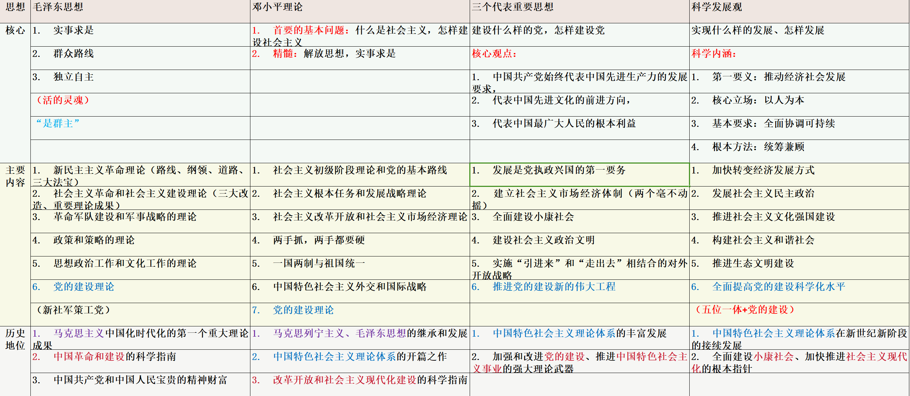

# 毛中特

# **绪论**

## 时间线

- 1840 年——1919 年 旧民主主义革命
  - 1840 年鸦片战争，是中国近代史的开端
  - 戊戌变法、辛亥革命：建立资本主义社会
- 1919 年——1949 年 新民主主义革命
  - 1919 年五四运动 是中国新民主主义革命的伟大开端，中国近代史上第一次彻底反帝反封建的革命运动，直接的斗争目标得到实现，无产阶级登上历史舞台
- 1949——1956 社会主义革命（改造）
- 1956 年底——今 社会主义初级阶段
  - 1956 年底——1978 年 社会主义建设的初步探索
  - 1978 年 十一届三中全会，改革开放
  - 1978——1989 邓小平理论
  - 1989——2002 “三个代表”重要思想（跨世纪）
  - 2002——2012 科学发展观
  - 2012 年党的十八大以来，中国特色社会主义进入新时代，创立习近平新时代中国特色社会主义思想

毛中特内容：在革命、建设、改革的不同历史时期，把作为根本指导思想的马克思主义，通过“两个”结合推动马克思主义中国化时代化进行理论创新所形成的理论与实践成果

马克思主义中国化时代化

- 内涵：**立足中国国情和时代特点，坚持把马克思主义基本原理同中国具体实际相结合、同中华优秀传统文化相结合**
- 马克思主义中国化这一命题的正式提出：**1938 年毛泽东在党的六届六中全会**上作了《论新阶段》的报告

中国共产党人的初心和使命：为中国人民谋幸福，为中华民族谋复兴

归结为一个主题：实现中华民族伟大复兴的中国梦

中国梦内涵：实现国家富强、民族振兴、人民幸福

### 马克思主义中国化时代化的历史进程

- 新民主主义革命时期、社会主义革命和建设时期
  - 毛泽东思想
    - 马克思主义中国化时代化的第一次历史性飞跃
- 改草开放和社会主义现代化建设新时期
  - 中国特色社会主义理论体系：新飞跃
    - 邓小平理论：什么是社会主义、怎样建设社会主义：开篇之作
    - “三个代表”重要思想：建设什么样的党、怎样建设党：成功推向 21 世纪
    - 科学发展观：实现什么样的发展、怎样发展：新形势下坚持和发展
- 总结
  | 思想 | 毛泽东思想 | 邓小平理论 | “三个代表”重要思想 | 科学发展观 |
  | ---- | ------------------------------ | -------------------------------------- | ------------------------------------------ | -------------------------- |
  | 核心 | 活的灵魂： | 什么是社会主义，怎样建设社会主义 | 建设什么样的党，怎样建设党 | 实现什么样的发展，怎样发展 |
  | | 实事求是 | 精髓：解放思想，实事求是 | 核心观点：中国共产党 | 科学内涵： |
  | | 群众路线 | | 始终代表中国先进生产力的发展要求 | 第一要义：推动经济社会发展 |
  | | 独立自主 | | 始终代表中国先进文化的前进方向 | 核心立场：以人为本 |
  | | | | 始终代表最广大人民的根本利益 | 基本要求：全面协调可持续 |
  | | | | | 根本方法：统筹兼顾 |
  | 内容 | 新民主主义革命理论 | 社会主义初级阶段理论和党的基本路线 | 发展是党执政兴国的第一要务 | 加快转变经济发展方式 |
  | | 社会主义革命和社会主义建设理论 | 社会主义根本任务和发展战略理论 | 建立社会主义市场经济体制 | 发展社会主义民主政治 |
  | | 革命军队建设和军事战略的理论 | 社会主义改革开放和社会主义市场经济理论 | 全面建设小康社会 | 推进社会主义文化强国建设 |
  | | 政策和策略的理论 | 两手抓，两手都要硬 | 建设社会主义政治文明 | 构建社会主义和谐社会 |
  | | 思想政治工作和文化工作的理论 | 一国两制与祖国统一 | 实施“引进来”和“走出去”相结合的对外开放战略 | 推进生态文明建设 |
  | | 党的建设理论 | 中国特色社会主义外交和国际战略 | 推进党的建设新的伟大工程 | 全面提高党的建设科学化水平 |
  | | | 党的建设理论 | | |

# **毛泽东思想**

## **毛泽东思想**形成的历史条件

- 国情：半殖民地半封建社会（第二章）
- 时代主题：战争与革命：帝国主义战争和无产阶级革命
- 19 世纪中叶，马克思、恩格斯提出唯物史观和剩余价值学说，创立了科学社会主义
- 1917 年俄国十月革命的胜利开辟了世界无产阶级社会主义革命的新时代，也给中国送来了马克思列宁主义
- 毛泽东思想形成和发展的实践基础：中国共产党领导人民进行革命和建设的成功实践

## **毛泽东思想**形成发展的过程

- 毛泽东思想开始萌芽：大革命时期（第一次国内革命战争）（1924-1927），提出关于新民主主义革命基本思想，标志着毛泽东思想开始萌芽《中国社会各阶级的分析》《湖南农民运动考察报告》
- 1927.8.7 八七会议：中国革命由大革命失败到土地革命兴起的历史转折点，毛泽东提出“枪杆子里面出政权”的论断，确定了土地革命和武装起义的方针
- **毛泽东思想初步形成**：土地革命战争时期（第二次国内革命战争）（1927-1937），开辟农村包围城市、武装夺取政权的革命道路，《中国的红色政权为什么能够存在？》《井冈山的斗争》《星星之火，可以燎原》《反对本本主义》
- **毛泽东思想趋于成熟**：
  - 遵义会议（1935.1）：党生死攸关的转折点，确立了毛泽东在党中央和红军的领导地位，在危急关头挽救了党、挽救了红军、挽救了中国革命
  - 遵义会议后：系统阐述了新民主主义革命理论，标志着毛泽东思想趋于成熟
    - 运用马克思主义认识论、辩证法系统分析了党内“左”和右的错误思想根源《实践论》《矛盾论》
    - 科学阐述新民主主义革命理论《<共产党人>发刊词》《中国革命和中国共产党》《新民主主义论》《改造我们的学习》《论联合政府》
    - **1945 年党的七大将毛泽东思想写入党章**
- 毛泽东思想继续发展
  - 解放战争时期和新中国成立后，把马克思列宁主义同中国具体实际进行“第二次结合，找出在中国怎样建设社会主义的道路”
    - 形成关于社会主义革命和社会主义建设的重要思想《论十大关系》《论人民民主专政》《关于正确处理人民内部矛盾的问题》

## 毛泽东思想的主要内容

### 新民主主义革命理论

- 第二章

### 社会主义革命和社会主义建设理论

- 第三章、第四章

### 革命军队建设和军事战略的理论

- 建设人民军队
  - 根本原则：坚持党对军队的绝对领导，即党指挥枪
  - 唯一宗旨：人民军队全心全意为人民服务

### 政策和策略的理论

- 论证了革命斗争中政策和策略问题的极端重要性，指出政策和策略是党的生命，必须根据政治形势、阶级关系和实际情况及其变化制定党的政策，把原则性和灵活性结合起来

### 思想政治工作和文化工作的理论

- 思想政治工作是经济工作和其他一切工作的生命线

### 党的建设理论

- 马克思主义政党的先进性，首先体现为思想理论上的先进性
- 注重思想建党、理论强党，是我们党的鲜明特色和光荣传统

## 毛泽东思想活的灵魂

**实事求是、群众路线、独立自主**

- **实事求是**
  - 是毛泽东思想的**基本点**，是毛泽东思想的**精髓**
  - 实事求是，就是一切从实际出发，理论联系实际，坚持在实践中检验真理和发展真理
  - 马根本观点、根本要求、思想路线，思想工作领导方法
  - 《反对本本主义》：没有调查，就没有发言权
  - 1937 年毛泽东在《实践论》《矛盾论》等著作中深刻阐述理论对于实践的依赖关系，以及矛盾的普遍性和特殊性的关系，对党的思想路线作了系统的哲学论证
  - 为此
    - 要深入实际了解事物的本来面貌，把握事物内在的必然联系，按照客观规律办事
    - 要清醒认识和正确把握我国基本国情
    - 要不断推进实践基础上的理论创新
- **群众路线**
  - 我们党的**生命线**和**根本工作路线**，我们党永葆青春活力和战斗力的重要传家宝
  - 就是一切为了群众，一切依靠群众，从群众中来，到群众中去，把党的重要主张变为群众的自觉行动
  - 本质上体现的是马克思主义关于人民群众是历史的创造者这一基本原理
  - 为此
    - 要坚持人民是推动历史发展的根本力量
    - 要坚持全心全意为人民服务的根本宗旨
    - 保持党同人民的血肉联系
- **独立自主**
  - 坚持独立思考，走自己的路，坚定不移地维护民族独立、捍卫国家主权，把立足点放在依靠自己力量的基础上，同时积极争取外援，开展国际经济文化交流，学习外国一切对我们有益的先进事物
  - 是中华民族的**精神之魂。**立国立党重要原则，必然结论、历史结论
  - 独立自主思想最初的明确表述：《反对本本主义》：中国革命斗争的胜利要靠中国同志了解中国情况
  - 为此
    - 要坚持中国的事情必须由中国人民自己作主张、自己来处理
    - 要坚持独立自主的和平外交政策，坚定不移走和平发展道路

## 毛泽东思想的历史地位

- 马克思主义中国化时代化的第一个重大理论成果
  - 为中国特色社会主义理论体系的形成奠定了理论基础，毛泽东思想关于社会主义建设的理论，为开创和发展中国特色社会主义做了重要的理论准备
- 中国革命和建设的科学指南
- 中国共产党和中国人民宝贵的精神财富
- 《决议》对毛泽东和毛泽东思想的历史地位作出了科学的、实事求是的评价
  - 毛泽东是伟大的马克思主义者，伟大的无产阶级革命家、战略家和理论家
  - 毛泽东的功绩是第一位的，错误是第二位的。他的错误是一个伟大的革命家、一个伟大的马克思主义者犯的错误
  - 将毛泽东晚年的错误同经过长期历史检验形成的科学理论的毛泽东思想区分开来，为我们完整准确地理解毛泽东思想、坚持和发展毛泽东思想指明了方向
- 本章小结
  - 毛泽东思想是马克思主义中国化时代化的**第一个重大理论成果**，是马克思列宁主义在中国的应用和发展，是被实践证明了的关于中国革命和建设的正确的的理论原则和经验总结，是中国共产党集体智慧的结晶，是党必须长期坚持的指导思想。
  - **毛泽东思想在土地革命战争时期（1927-1937）形成，在抗日战争时期走向成熟，并在解放战争时期和中华人民共和国成立后继续发展**。
  - **新民主主义革命理论、社会主义革命和社会主义建设理论、革命军队建设和军事战略的理论、政策和策略的理论、思想政治工作和文化工作的理论、党的建设理论**，这些是毛泽东思想的主要内容。
  - 实事求是、群众路线、独立自主是毛泽东思想活的灵魂。

# 新民主主义革命理论

## 形成依据

### 近代中国国情与中国革命时代特征

- 近代中国最基本的国情：半殖民地半封建社会
  - 一方面，帝国主义的侵略虽然在一定程度上促使封建社会自给自足的自然经济解体，在客观上为中国资本主义发展创造了一定条件，但是中国不可能发展成为资本主义国家
  - 另一方面，帝国主义列强通过政治的、经济的和文化的侵略，使中国半殖民地化
  - 近代中国的社会主要矛盾：帝国主义和中华民族的矛盾（最主要）、封建主义和人民大众的矛盾
- 近代中国革命的时代特征
  - 近代中国革命是资产阶级民主革命
    - 由近代中国的社会性质和主要矛盾所决定
  - 经历了从旧民主主义革命到新民主主义革命的转变，具有鲜明的时代特征

### 新民主主义革命理论的实践基础

- 旧民主主义革命的失败呼唤新的革命理论
- 新民主主义革命的艰辛探索奠定了革命理论形成的实践基础

## 新民主主义革命的总路线

总路线是党和国家在某个历史阶段制定各方面具体工作路线和政策的总依据，是根本指导路线

**新民主主义革命总路线的内容：无产阶级领导的，人民大众的，反对帝国主义、封建主义、官僚资本主义的革命**

完整表述：1948 年毛泽东在《在晋绥干部会议上的讲话》

### 革命的对象

- 分清敌友是革命的首要问题
- 帝国主义、封建主义、官僚资本主义是压在中国人民头上的三座大山
- 帝国主义是中国革命的首要对象，近代中国所遭受的最大的压迫是来自帝国主义的民族压迫
- 封建地主阶级是帝国主义统治中国和封建军阀实行专制统治的社会基础
  - 反对封建主义，从根本上说，就是要在经济上消灭封建土地所有制，在政治上消灭封建的官僚军阀专制统治，消灭地主阶级，解放生产力，为中国的经济现代化和政治民主化创造条件
- 帝国主义和封建主义相互勾结，残酷地压迫和掠夺中国人民，严重地阻碍着中国社会的发展
- 官僚资本主义是依靠帝国主义、勾结封建势力、利用国家政权力量而发展起来的买办的、封建的国家垄断资本主义
- 不同历史阶段革命的主要对象有所不同
  - 国共合作的大革命时期（1924-1927）：帝国主义支持下的北洋军阀
  - 土地革命战争时期（1927-1937）：国民党新军阀
  - 抗日战争时期：日本帝国主义
  - 解放战争时期：美帝国主义支持下的国民党反动派

### 革命的动力

- 无产阶级：中国革命最基本的动力
  - 无产阶级是新的社会生产力的代表，是近代中国最进步的阶级，是中国革命的领导力量
- 农民阶级：中国革命的主力军
  - 农民问题是中国革命的基本问题
  - 新民主主义革命实质上是党领导下的农民革命，中国革命战争实质上是党领导下的农民战争
- 城市小资产阶级：无产阶级的可靠同盟者
- 民族资产阶级：带有两面性

### 革命的领导力量

- 无产阶级的领导权是中国革命的中心问题，也是新民主主义革命理论的核心问题
- 区分新旧民主主义革命的根本标志是，革命的领导权掌握在无产阶级手中还是资产阶级手中

### 革命的性质和前途

- 新民主主义革命的性质是资产阶级民主主义革命
- 新旧民主主义革命的区别
  - 新民主主义革命处于世界无产阶级社会主义革命的时代，是世界无产阶级社会主义革命的一部分
  - 革命的领导力量是中国无产阶级及其先锋队——中国共产党
  - 革命的指导思想是马列主义
  - 革命的前途是社会主义而不是资本主义

## 新民主主义革命的基本纲领

- 政治纲领
  - 推翻帝国主义和封建主义的统治，建立一个无产阶级领导的、以工农联盟为基础的、各革命阶级联合专政的新民主主义共和国
  - 国体：各革命阶级联合专政
  - 政体：民主集中制的人民代表大会制度
- 经济纲领
  - **“两没收一保护”**
  - 主要内容：没收封建地主阶级的土地归农民所有
  - 应有之义：没收官僚资产阶级的垄断资本归新民主主义的国家所有
    - 是包含新民主主义革命和社会主义革命双重性质的事件
  - 特色内容：保护民族工商业
- 文化纲领
  - 新民主主义文化是**民族的**
    - 内容：反对帝国主义压迫、主张中华民族的尊严和独立
    - 形式：民族风格、民族形式、民族特色，中国作风、中国气派，吸收外国的进步文化
  - 新民主主义文化是**科学的**
    - 反对封建思想和迷信思想，主张实事求是、客观真理及理论与实践的一致性
    - 反对割裂历史、民族虚无主义，发展民族新文化、提高民族自信心
  - 新民主主义文化是**大众的**
    - 为工人阶级和劳动群众服务，主张文化普及于大众又提高大众
    - 用革命文化教育和武装人民大众，成为有力思想武器
    - 从人民中汲取营养，以人民群众的实践作为创作的源泉

## 新民主主义革命的道路和基本经验

### 新民主主义革命道路

- 道路：**农村包围城市、武装夺取政权**
- 道路的内容：处理好**土地革命、武装斗争、农村革命根据地建设**三者的关系
  - 土地革命是中国革命的基本内容
  - 武装斗争是中国革命的主要形式，是农村革命根据地建设和土地革命的强有力保证
  - 农村革命根据地是中国革命的战略阵地，是进行武装斗争和开展土地革命的依托
- 道路形成的必然性
  - 一方面，在半殖民地半封建的中国社会，内无民主制度而受封建主义的压迫，外无民族独立而受帝国主义的压迫
    中国革命的主要斗争形式只能是武装斗争，以革命的武装消灭反革命的武装，相应的主要组织形式必然是军队
  - 另一方面，近代中国是一个农业大国，农民占全国人口的绝大多数，是无产阶级可靠的同盟军和革命的主力军
    在中国开展革命斗争，必须充分地发动农民，凝聚农民阶级的革命力量，否则就无法摧毁帝国主义和封建地主阶级反动统治的基础
    这就要求无产阶级及其政党必须深入农村，从解决农民的土地问题入手，组织、发动和武装农民，使革命战争获得广大农民的支持和参加，为最后夺取全国政权奠定基础

### 新民主主义革命的三大法宝

提出：毛泽东在《<共产党人>发刊词》中提出了**统一战线、武装斗争、党的建设**是党在中国革命中战胜敌人的三个主要法宝

- **统一战线**
  - 两个联盟
    - 工农联盟
    - 工人阶级和非劳动人民的联盟
  - 建立、巩固和发展统一战线的实践经验
    - 建立巩固工农联盟
    - 正确对待资产阶级，尤其是民族资产阶级
    - 采取区别对待的方针：坚持发展进步势力、争取中间势力、孤立顽固势力
    - 坚持独立自主的原则，保持党在政治上、组织上、思想上的独立性
- **武装斗争**
  - 建设人民军队
    - 根本原则：坚持党对军队的绝对领导
    - 唯一宗旨：人民军队全心全意为人民服务
    - 要开展革命的政治工作（官兵一致、军民一致）
    - 坚持正确的战略战术原则
- **党的建设**
  - 党的建设是“伟大工程”
  - 党的建设的经验
    - 思想建设：是党的建设的首位，关键是要以无产阶级思想克服和改造各种非无产阶级思想
    - 组织建设：贯彻民主集中制这一根本组织原则
    - 作风建设（三大优良作风：理论联系实际、密切联系群众、批评与自我批评）
    - 联系党的政治路线加强党的建设，加强党的建设必须同党的政治路线紧密联系起来

### 新民主主义革命理论的意义

- 新民主主义革命理论是以毛泽东为主要代表的中国共产党人，把马列主义基本原理同中国革命具体实践相结合，在认真总结中国革命实践经验基础上形成的具有独创性的革命理论
- 揭示了近代中国革命发展的客观规律，解决了中国革命一系列理论问题，极大地丰富了马克思主义的理论宝库
- 开辟了马克思主义中国化时代化的发展道路
- 是中国共产党集体智慧的结晶
- 1949 年建立了中华人民共和国，实现了民族独立、人民解放，中国发展从此开启了新纪元
- 本章小结
  新民主主义革命理论是中国共产党在分析近代中国国情和时代特征的基础上，对中国革命实践经验的概括和总结。
  近代中国社会的性质和主要矛盾，决定了中国革命**首要任务是推翻帝国主义、封建主义和官僚资本主义的统治**，从根本上推翻反动腐朽的政治上层建筑，变革阻碍生产力发展的生产关系
  新民主主义革命总路线的内容是**无产阶级领导的，人民大众的，反对帝国主义、封建主义和官僚资本主义的革命**。新民主主义的**政治、经济和文化纲领**是新民主主义革命总路线的展开和具体化，指明了新民主主义革命的发展方向。中国革命必须走**农村包围城市、武装夺取政权的革命道路**。
  **统一战线、武装斗争、党的建设是新民主主义革命的三大法宝，是新民主主义革命胜利的基本经验。**

# 社会主义改造理论

## 从新民主主义到社会主义的转变

### 新民主主义社会是一个过渡性的社会

- 五种经济成分：社会主义性质的国营经济、半社会主义性质的合作社经济、农民和手工业者的个体经济、私人资本主义经济、国家资本主义经济
- 三种主要经济成分：社会主义经济、个体经济、资本主义经济
- 集中表现为社会主义和资本主义两条道路、工人阶级和资产阶级两个阶级的矛盾
- 新民主主义社会中，社会主义的因素无论在经济上还是在政治上都已经居于领导地位

### 党在过渡时期总路线

- 1949.3 党的七届二中全会：“两个转变”同时并举的思想
  - 稳步地由农业国转变为工业国，由新民主主义国家转变为社会主义国家
- 三年国民经济恢复时期：1949-1952
  - 完成土地改革，进行社会各方面民主改革
- 1953 年 6 月正式提出，党在过渡时期总路线的主要内容：**“一化三改”**
  - **“一化”即社会主义工业化，“三改”即对个体农业、手工业和资本主义工商业的社会主义改造**
  - “一体两翼”：“一化”是“主体”，“三改”是“两翼”，相互联系，不可分离，相辅相成，互相促进
  - 这是一条社会主义建设和社会主义改造同时并举的路线
- 理论依据：马克思列宁主义及其与中国实际相结合
- 现实依据：
  - 物质基础：社会主义国营经济优越性的明显表现
  - 重要依据：广大农民走互助合作道路的要求
  - 重要因素：从低级到高级的国家资本主义形式的出现
  - 国际环境：资本主义国家的不景气和社会主义国家向上发展的活力

## 社会主义改造道路和历史经验

### 适合中国特点的社会主义改造道路

- 农业的社会主义改造
  - 积极组织农民，走合作互助道路
  - 遵循**自愿互利、典型示范和国家帮助**的原则
  - 正确分析农村的阶级和阶层状况，制定正确的阶级政策
    - 依靠贫下中农，发展互助合作，由逐步限制到最后消灭富农剥削的农村阶级政策
    - 使农业合作化有了坚实的阶级基础和群众基础
  - 坚持**积极领导、稳步前进**的方针，采取循序渐进的步骤
    - 发展阶段：互助组、初级农业生产合作社、高级农业生产合作社
  - 手工业的社会主义改造
    - 方针：积极领导、稳步前进
    - 步骤：手工业供销小组、手工业供销合作社、手工业生产合作社
  - 资本主义工商业的社会主义改造
    - 方式：和平赎买
    - 步骤：初级形式的国家资本主义（同资本家在企业外部的合作）、个别企业的公私合营（社会主义成分同资本主义成分在企业内部的合作）、全行业的公私合营
    - “四马分肥”：企业的利润按国家所得税、企业公积金、工人福利费、资方红利四个方面分配
    - 资本主义工商业者：改造成自食其力的社会主义劳动者

### 社会主义改造的历史经验

- 坚持社会主义工业化建设与社会主义改造同时并举
- 采取积极领导、稳步前进的方式
- 用和平方法进行改造

## 社会主义基本制度在中国的确立

### 社会主义基本制度的确立及其理论依据

- 1956 年底，我国对农业、手工业和资本主义工商业的社会主义改造基本完成，标志着社会主义基本制度的确立
- 《中华人民共和国宪法》是中国人民近代以来为实现中华民族伟大复兴而英勇奋斗的历史经验总结，也是中华人民共和国成立以来的心得经验总结
  - 宪法规定了国体：人民民主专政，政体：人民代表大会制度
  - 根本政治制度：人民代表大会制度
  - 基本政治制度：中国共产党领导的多党合作和政治协商制度、民族区域自治制度

### 社会主义基本制度的确立重大意义

- 为当代中国一切发展进步奠定了制度基础，为中国特色社会主义制度的创新和发展提供了重要前提
  - 社会主义制度的建立极大地提高工人阶级和广大劳动人民的积极性、创造性，极大地促进了我国社会生产力的发展
- 使中国进入了社会主义社会，是世界社会主义发展史上历史性的伟大胜利，改变了世界政治经济格局，加强了社会主义的力量，对维护世界和平产生了积极影响
- 证明了马克思列宁主义的真理性，用独创性的理论原则和经验总结丰富和发展了科学社会主义理论

# 社会主义建设道路的初步探索和理论成果

## 初步探索的重要理论成果（3+X）

### 调动一切积极因素为社会主义事业服务

- 《论十大关系》标志着党探索中国社会主义建设道路的**良好开端**
- 《论十大关系》明确提出要以苏为鉴，独立自主地探索适合中国情况的社会主义建设道路
- 《论十大关系》确定了一个基本方针：**调动一切积极因素为社会主义事业服务**
- 社会主义建设需要重点把握的一系列重大关系：
  - 经济领域：重工业和轻工业、农业的关系；沿海工业和内地工业的关系；经济建设和国防建设的关系；国家、生产单位和生产者个人的关系；中央和地方的关系
  - 政治生活和思想文化生活领域：汉族和少数民族的关系；党和非党的关系；革命和反革命的关系；是非关系；中国和外国的关系
- 为此
  - 必须坚持中国共产党的领导
  - 必须发展社会主义民主政治

### 正确认识和处理社会主义社会矛盾的思想

- 1957.2 毛泽东《关于正确处理人民内部矛盾的问题》的报告，系统论述了社会主义社会矛盾的理论
  - 毛泽东指出，矛盾是普遍存在的，社会主义社会同样充满矛盾，正是这些矛盾推动着社会主义社会不断向前发展
  - 提倡运用**对立统一规律**深刻分析社会主义社会的矛盾
- 社会主义社会**基本矛盾**：**生产关系和生产力之间的矛盾，上层建筑和经济基础之间的矛盾**
  - 社会主义社会基本矛盾运动具有“又相适应又相矛盾”的特点，是非对抗性的矛盾
    - 一方面社会主义生产关系已经建立起来，它是和生产力的发展相适应的，相适应的一面是基本方面
    - 另一方面它还很不完善，这些不完善的方面和生产力的发展又是相矛盾的，相矛盾的一面是非基本方面
- 1956 年中共八大确定社会**主要矛盾**：
  - **人民对于建立先进的工业国的要求 同落后的农业国的现实之间的矛盾；人民对于经济文化迅速发展的需要 同当前经济文化不能满足人民需要的状况之间的矛盾**
- 两类不同性质的社会矛盾
  - 敌我矛盾：人民同反抗社会主义革命、敌视和破坏社会主义建设的社会势力和社会集团的矛盾
    - 分清敌我，根本利益对立的矛盾、对抗性矛盾，专政方法
  - 人民内部矛盾：
    - 分清是非，根本利益一致基础上的矛盾、非对抗性矛盾，民主方法
    - 用民主方法解决人民内部矛盾的一系列具体方针
      - 政治思想领域：“团结—批评—团结”，坚持说服教育、讨论的方法
      - 利益分配方面：统筹兼顾、适当安排，兼顾国家、集体和个人三方面的利益
      - 人民群众和政府机关：坚持民主集中制原则
      - 科学文化领域：“百花齐放、百家争鸣”
      - 共产党与民主党派：坚持社会主义道路和共产党领导前提下的“长期共存，互相监督”
      - 民族之间：民族平等、团结互助的方针

### 走中国工业化道路的思想

- 毛泽东提出发展国民经济的总方针：以农业为基础，以工业为主导，以农轻重为序发展国民经济
- “两条腿走路”方针：重工业&轻工业、中央工业&地方工业、沿海工业&内地工业、大型企业&小型企业同时并举
- 为此，走中国工业化道路：
  - 必须采取正确的经济建设方针
    - 1956 年党的八大提出既反保守又反冒进、坚持在综合平衡中稳步前进的方针
  - 必须调整和完善所有制结构
    - 毛泽东、刘少奇、周恩来：把资本主义经济作为社会主义经济的补充
    - 朱德：注意发展手工业和农业多种经营
    - 陈云：“三个主体，三个补充”
      - 工商业经营方面：国家经营和集体经营是主体，一定数量的个体经营是补充
      - 生产计划方面：计划生产是工农业生产的主体，按照市场变化在国家计划许可范围内进行的自由生产是补充
      - 社会主义统一市场里：国家市场是主体，一定范围内国家领导的自由市场是补充
  - 必须积极探索适合我国情况的经济体制和运行机制
    - 毛泽东：发展商品生产、利用价值规律
    - 刘少奇：使社会主义经济既有计划性又有多样性和灵活性的主张
    - 陈云：提出要建立“适合于我国情况和人民需要的社会主义的市场”

---

初步探索的其他理论成果：

### 关于社会主义发展阶段的思想

- 社会主义可以分为不发达的社会主义和比较发达的社会主义两个阶段

### 关于“四个现代化”战略目标

- **现代农业、现代工业、现代国防和现代科学技术**
- 两步走
  - 第一步，从第三个五年计划开始，建立一个独立的比较完整的工业体系和国民经济体系
  - 第二步，要全面实现“四个现代化”，使中国的经济发展走在世界的前列

## 初步探索的意义（X）

- 巩固和发展了我国的社会主义制度
- 为开创中国特色社会主义提供了宝贵经验、理论准备、物质基础
- 丰富了科学社会主义的理论和实践

## 初步探索的经验教训（X）

- 必须把马克思主义与中国实际相结合，探索符合中国特点的社会主义建设道路
- 正确认识社会主义社会的主要矛盾和根本任务，集中力量发展生产力
- 必须从实际出发进行社会主义建设，建设规模和速度要与国力相适应，不能急于求成
- 必须发展社会主义民主，健全社会主义法制
  - 社会主义民主的本质是人民当家作主
- 必须坚持党的民主集中制和集体领导制度，加强执政党建设
- 必须坚持对外开放，借鉴和吸收人类文明成果建设社会主义，不能关起门来搞建设

# 中国特色社会主义理论体系

## 形成发展的社会历史条件

### 国际背景

- 和平与发展成为时代主题
- 世界多极化和经济全球化深入发展，综合国力竞争日趋激烈

### 实践基础

- 社会主义现代化建设和改革开放

## 形成发展的过程

- 1978 年 12 月党的十一届三中全会
  - 重新确立了实事求是的思想路线，彻底否定了“以阶级斗争为纲”的错误理论和实践，确定把全党工作的重点转移到社会主义现代化建设上来，作出实行改革开放的重大决策，实现了党的历史上具有深远意义的伟大转折
- 主题形成：1982 年党的十二大，提出“中国特色社会主义”重大命题
- 邓小平理论轮廓形成：1987 年党的十三大，系统论述我国社会主义初级阶段理论的科学内涵（基本'最大'国情），系统概括了中国特色社会主义理论的主要内容
- 邓小平理论走向成熟：1992 年南方谈话
  - 南方谈话是邓小平理论的集大成之作，从理论上深刻地回答了当时困扰和束缚人们思想的一系列重大问题

---

- 继续发展：1997 年党的十五大正式提出“邓小平理论”这一概念，邓小平理论确立为党的指导思想，写入党章
- 跨世纪发展：“三个代表”重要思想：建设什么样的党、怎样建设党：成功把中国特色社会主义推向 21 世纪
  - 2002 年党的十六大将“三个代表”重要思想写入党章
- 新世纪新阶段的新发展：科学发展观：“实现什么样的发展、怎样发展”
  - 2007 年党的十七大将科学发展观写入党章
- 新时代的新篇章：习近平新时代中国特色社会主义思想
  - 2017 年党的十九大把习近平新时代中国特色社会主义思想写入党章

# 邓小平理论

## 首要的基本理论问题和精髓

### 邓小平理论首要的基本理论问题

- 邓小平理论首要的基本理论问题：**什么是社会主义、怎样建设社会主义**
- 1992 年初，邓小平在南方谈话中对社会主义本质做出了总结性的理论概括
  - **社会主义的本质：解放生产力，发展生产力，消灭剥削，消除两极分化，最终达到共同富裕**
    - 既包括了社会主义社会的生产力问题，又包括了社会主义社会的生产关系问题，是一个有机的整体

### 邓小平理论的精髓

理论的精髓是指能使这一理论得以形成和发展并贯彻始终，同时又体现在这一理论中最本质的东西

- 邓小平理论的精髓：**解放思想、实事求是**
  - 解放思想和实事求是是辩证统一的关系，注意克服主观主义、盲目性、片面性和绝对化，掌握科学辩证法，按客观规律办事
  - 有力推动和保证了拨乱反正的进行
  - 破除了僵化的社会主义模式观念，坚持走自己的路
  - 一切从社会主义初级阶段的实际出发
  - 坚持“三个有利于”作为检验一切工作是非得失的根本准则，破除了在改革开放进程中离开发展生产力抽象谈论姓“资”姓“社”的思维定势
    - 是否有利于发展社会主义社会的生产力 ，是否有利于增强社会主义国家的综合国力，是否有利于提高人民的生活水平

## 主要内容

### 社会主义初级阶段理论和党的基本路线

### 社会主义初级阶段理论

- 1987 年党的十三大系统地阐述了社会主义初级阶段的科学内涵
- 社会主义初级阶段的两层含义
  - 我国已经是社会主义社会
  - 还处在初级阶段，必须从这个实际出发而不能超越这个阶段
- 社会主义初级阶段具有长期性（过程性）
- 社会主义初级阶段的基本特征：五个维度的概况+党的十五大的概括

### 党在社会主义初级阶段的基本路线

- 主要内容：**以经济建设为中心，坚持四项基本原则，坚持改革开放**
  - 简明概括：**“一个中心，两个基本点”**
    - 以经济建设为中心：党在改革开放和社会主义现代化建设新时期实现的最根本的拨乱反正
    - 坚持四项基本原则：坚持社会主义道路、坚持人民民主专政、坚持共产党的领导、坚持马列主义毛泽东思想
    - 坚持改革开放：是决定中国命运、实现伟大复兴的关键一招
  - 四项基本原则是**立国之本**，是我们党和国家生存发展的政治基石
  - 改革开放是**强国之路**，是我们党和国家发展进步的活力源泉
  - 把两个基本点有机结合起来，既要以四项基本原则保证改革开放的正确方向，又要通过改革开放赋予四项基本原则新的时代内涵
  - 要把一个中心两个基本点统一于中国特色社会主义的伟大实践，贯穿于社会主义现代化建设的整个过程
- 党的基本路线在改革开放实践中不断充实和完善

### 社会主义根本任务和发展战略理论

### 社会主义根本任务

- **社会主义根本任务是发展生产力**，党和国家的工作重点是经济建设
- 中国解决所有问题的关键是要靠自己的发展，归根结底，“发展才是硬道理”
- 发展生产力离不开科学技术，邓小平提出关于“科学技术是第一生产力”的重要论断

### 分三步走基本实现现代化的发展战略

- 1987 年党的十三大把邓小平提出的**“小康社会”思想**和**“三步走”的发展战略构想**确定下来
- 第一步，到 1990 年，实现国民生产总值比 1980 年翻一番，解决人民的温饱问题
- 第二步，到 20 世纪末国民生产总值与 1991 年比再增长 1 倍，人民生活达到小康水平
- 第三步，到 21 世纪中叶人均国民生产总值达到中等发达国家水平，人民生活比较富裕，基本实现现代化

### 社会主义改革开放和社会主义市场经济理论

### 社会主义改革开放

- 改革
  - 是一场深刻的社会变革、是中国的第二次革命、是实现中国现代化的必由之路
    - 改革不是一个阶级推翻另一个阶级那种原来意义上的革命，而是社会主义制度的自我完善与发展
  - 是社会主义社会发展的直接动力
  - 是崭新的事业、大试验
- 开放
  - 对外开放是建设中国特色社会主义的一项基本国策
  - 是深刻总结中国经济发展停滞历史教训的结果
  - 对世界所有国家的开放
    - 正确对待资本主义社会创造的现代文明成果
    - 要珍惜并维护中国人民经过长期奋斗得来的独立自主权利

### 社会主义市场经济理论

- 1992 年邓小平南方谈话的精辟论述，标志着邓小平的社会主义市场经济理论的形成，为~奠定了理论基础
  - 1992 年党的十四大明确把建立社会主义市场经济体制作为我国经济体制改革的目标
- 丰富内涵：
  - 一是计划经济和市场经济不是划分社会制度的标志，计划经济不等于社会主义，市场经济也不等于资本主义
  - 二是计划和市场都是经济手段，对经济活动的调节各有优劣，社会主义实行市场经济是要把两者优势结合起来
  - 三是市场经济作为资源配置手段本身不具有制度属性，可以和不同的社会制度结合，从而表现出不同的性质
- 重要意义
  - 邓小平的社会主义市场经济理论，实现了马克思主义政治经济学的重大创新，是中国特色社会主义政治经济学的重要组成部分
  - 为社会主义市场经济体制改革目标的确立和中国特色社会主义经济建设提供了指南

### “两手抓，两手都要硬”

- 一系列“两手抓”
  - 一手抓物质文明、一手抓精神文明
  - 一手抓建设、一手抓法制
  - 一手抓改革开放、一手抓惩治腐败
- 意义
  - 坚持了辩证法的全面性，坚持了两点论和重点论的统一
  - 有利于克服实际工作中存在的“一手硬、一手软”的问题，为我们党的领导方法和工作方法充实了新的内容

### “一国两制”与祖国统一

“一国两制”构想的形成和发展

- “一国两制”的基本内容
  - **坚持一个中国**是核心，是发展两岸关系和实现和平统一的基础
  - **两制并存**，在祖国统一的前提下，国家的主体部分实行社会主义制度，同时在港澳台保持原有的社会制度和生活方式长期不变
- “一国两制”构想是邓小平运用辩证唯物主义和历史唯物主义，坚持实事求是，把和平共处原则运用于解决一个国家的统一问题
  - 原则性：祖国统一、维护国家主权
  - 灵活性：照顾历史实际和现实可能
- 意义
  - 创造性发展了马克思主义国家学说
  - 开辟了以和平方式实现祖国统一的新路径

### 中国特色社会主义外交和国际战略（了解）

- 时代主题：和平与发展
  - 和平问题——东西问题
  - 发展问题——南北问题——核心问题
- 外交政策
  - 根本立场：反对霸权主义、维护世界和平
  - 国家范围：同所有国家发展友好合作关系，高度重视第三世界国家
  - 新秩序：和平、稳定、公正、合理
  - 党际关系：坚持以独立自主、完全平等、相互尊重、互不干涉内部事务原则处理
  - 指导方针：冷静观察、稳住阵脚、沉着应付

### 党的建设（了解）

- 是党领导人民取得革命和建设胜利的一个法宝
- 重视马克思主义理论学习是必修课
- 加强组织建设是重要环节
- 加强领导班子建设是根本大计
- 党风建设关系生死存亡
- 制度建设更具有根本性、全局性、稳定性和长期性

## 历史地位

- 马克思列宁主义、毛泽东思想的继承和发展
  - 邓小平理论是马克思列宁主义基本原理同当代中国实际和时代特征相结合的产物，是对马克思列宁主义、毛泽东思想的继承和发展，是全党全国人民集体智慧的结晶
  - 邓小平是我国改革开放和社会主义现代化建设的总设计师，对邓小平理论的创立作出了历史性的重大贡献
  - 邓小平理论坚持解放思想、实事求是，在新的实践基础上既继承前人又突破陈规，开拓了马克思主义的新境界。解放思想、实事求是是邓小平理论的精髓
  - 邓小平理论坚持马克思列宁主义、毛泽东思想的基本原理坚持辩证唯物主义和历史唯物主义的立场观点方法，坚持马克思主义的思想路线
  - 围绕什么是社会主义、怎样建设社会主义的问题，系统回答了在中国这样经济文化比较落后的东方大国建设、巩固和发展社会主义的一系列基本问题
  - 用一系列独创性的思想、观点，继承、丰富和发展了马克思列宁主义、毛泽东思想
- 中国特色社会主义理论体系的开篇之作
  - 邓小平理论第一次比较系统地初步回答了建设中国特色社会主义的一系列基本问题
- 改革开放和社会主义现代化建设的科学指南
  - 邓小平理论指导了改革开放的伟大实践

# “三个代表”重要思想

回答了“建设什么样的党，怎样建设党”的问题

精髓：**解放思想、实事求是、与时俱进**

## 核心观点

### 始终代表中国先进生产力的发展要求

就是党的理论、路线、纲领、方针、政策和各项工作，必须努力符合生产力发展的规律，体现不断推动社会生产力的解放和发展的要求，尤其要体现推动先进生产力发展的要求，通过发展生产力不断提高人民群众的生活水平

- 中国共产党作为执政党的使命
- 根本动力是改革
- 推动我国先进生产力发展和社会全面进步的根本力量是广大工人、农民和知识分子
- 人是生产力中最活跃的因素
  - 开发人力资源、加强人力资源能力建设，大力实施人才战略，加强人才队伍建设
- 科学技术是第一生产力，是先进生产力的集中体现和主要标志。科技进步和创新是发展生产力的决定因素
- 生产力的解放和发展的广阔通途是不断完善的社会主义生产关系和上层建筑

### 始终代表中国先进文化的前进方向

就是党的理论、路线、纲领、方针、政策和各项工作，必须努力体现发展面向现代化、面向世界、面向未来的，民族的科学的大众的社会主义文化的要求，促进全民族思想道德素质和科学文化素质的不断提高，为我国经济发展和社会进步提供精神动力和智力支持

- 发展先进文化：
  - 是实现社会主义现代化的战略任务
  - 是发展中国特色社会主义的文化和建设社会主义精神文明
  - 要发展面向现代化、面向世界、面向未来的，民族的科学的大众的社会主义文化
  - 要把弘扬主旋律和提倡多样化统一起来，支持健康有益文化、努力改造落后文化、坚决抵制腐朽文化
  - 弘扬民族精神是极为重要的任务
  - 重要内容和中心环节是加强社会主义思想道德建设
  - 重要任务是做好思想政治工作
  - 基础工程是教育
  - 重要组成部分是繁荣发展哲学社会科学
  - 需要充分发挥新闻媒体作用、需要重视社会主义文艺事业的繁荣发展、需要大力推进文化体制改革

### 始终代表中国最广大人民的根本利益

就是党的理论、路线、纲领、方针、政策和各项工作，必须坚持把人民的根本利益作为出发点和归宿，充分发挥人民群众的积极性主动性创造性，在社会不断发展进步的基础上，使人民群众不断获得切实的经济、政治、文化利益

- **人民是我们国家的主人、人民是决定我国前途和命运的根本力量、人民是历史的真正创造者**
- 我们党作为执政党面临的最根本课题：能不能始终代表最广大人民的根本利益、始终全心全意为人民服务
- 党的一切工作的最高标准：最广大人民根本利益
- 人民根本利益
  - 全国人民的根本利益是一致的
  - 各种具体的利益关系和内部矛盾可以在这一基础上调节

## 主要内容

### 发展是党执政兴国的第一要务

- 发展是硬道理
  - 巩固和推进中国特色社会主义靠发展
  - 国际竞争中赢得主动需要发展
  - 解决前进中的问题用发展
  - 中国解决所有问题的关键在于依靠自己的发展
  - 为此
    - 要善于抓住机遇、珍惜机遇、用好机遇
    - 坚持社会主义物质文明、政治文明和精神文明协调发展
    - 促进人的全面发展
    - 正确认识和处理改革、发展、文鼎的关系
    - 毫不动摇地坚持党在社会主义初级阶段的基本路线（“一个中心，两个基本点”）

### 建立社会主义市场经济体制

- 坚持和完善公有制为主体、多种所有制经济共同发展的社会主义基本经济制度
  - 两个毫不动摇
    - 毫不动摇地巩固和发展公有制经济
    - 毫不动摇地鼓励、支持和引导非公有制经济发展
  - 探索公有制特别是国有制的有效实现形式
    - 公有制的实现形式指资本的经营方式和组织形式 e.g. 经营方式：租赁式 组织形式：股份制
- 发挥市场机制的作用和国家宏观调控是本质要求
- 完善适应社会主义市场经济体制的分配关系
  - 按劳分配为主体、多种分配方式并存
  - 共同富裕为目标
- 建立和完善社会保障体系是重要内容

### 全面建设小康社会

- 党的十五大初步勾画了展望 21 世纪实现第三步战略目标的蓝图
  - 第一个十年、建党一百年、建国一百年
  - 党的十六大深刻阐述了全面建设小康社会的奋斗目标
    - 21 世纪头 20 年，全面建设惠及十几亿人口的更高水平的小康社会
  - 必经的承上启下的发展阶段、关键阶段，符合国情、符合人民愿望

### 建设社会主义政治文明

- 建设社会主义政治文明，发展社会主义民主政治，是社会主义现代化建设的重要目标
- 为此：
  - 必须发展社会主义民主
  - 必须坚持和完善中国特色社会主义政治制度，必须坚持人民代表大会制度
  - 必须坚持依法治国，建设社会主义法治国家
  - 必须进行政治体制改革
  - 必须推进决策的科学化民主化
  - 必须尊重和保障人权

### 实施“引进来”和“走出去”相结合的对外开放战略

- 对外开放是一项长期的基本国策
- 加强同世界的联系、加入 WTO，办好经济特区，“走出去”，世界各国文明成果，注意维护国家主权和经济社会安全，防范风险

### 推进党的建设新的伟大工程

- 关键在党，核心地位，坚持党的先进性，加强党的执政能力建设，用马克思主义武装全党，把党的最低纲领和最高纲领统一起来，民主集中制，正确的用人方向，领导干部要学习、讲政治、讲正气，基层党组织建设，党要管党、全面从严治党，反对和防止腐败

## 历史地位

- 中国特色社会主义理论体系的丰富发展
- 加强和改进党的建设、推进中国特色社会主义事业的强大理论武器
- 始终做到“三个代表”，是我们党的立党之本、执政之基、力量之源

# 科学发展观

回答了“实现什么样的发展、怎样发展”的问题

精髓：**解放思想、实事求是、与时俱进、求真务实**

## 科学内涵

### 第一要义：推动经济社会发展

- 党执政的首要任务是带领人民推动经济社会发展
- 发展是硬道理的本质要求就是坚持科学发展
- 讲求质量和效益，以人为本、全面协调可持续
- 坚持科学发展
  - 加快转变经济发展方式
  - 推动科学技术的跨越式发展
  - 培养高素质创新型人才
  - 善于抓住和用好机遇

### 核心立场：以人为本

- 执政理念：立党为公、执政为民
- 根本目的：促进人的全面发展
- 根本宗旨：全心全意为人民服务
- 坚持以人为本
  - 发展为了人民，始终把最广大人民的根本利益放在第一位
  - 发展依靠人民，从人民群众的伟大创造中汲取智慧和力量
  - 发展成果由人民共享，着力提高人民物质文化生活水平
  - 最终是为了实现人的全面发展

### 基本要求：全面协调可持续

- 原因
  - 积累了雄厚的物质技术条件，可以在推进全面协调可持续发展上有更大作为
  - 城乡区域发展不平衡、经济社会发展不协调、经济发展与人口资源环境不适应问题突出
- 内涵
  - 全面：发展要有全面性、整体性
  - 协调：发展要有协调性、均衡性
  - 可持续：发展要有持久性、连续性
- 为此
  - 全面发展：按照中国特色社会主义事业总体布局，正确认识和把握经济建设、政治建设、文化建设、社会建设、生态文明建设是相互联系、相互促进的有机统一体
  - 协调发展：保证中国特设社会主义各个领域协调推进
  - 可持续发展：坚定走生产发展、生活富裕、生态良好的文明发展道路

### 根本方法：统筹兼顾

- 体现了唯物辩证法在发展问题上的科学运用
- 坚持统筹兼顾
  - 正确认识和妥善处理中国特色社会主义事业中的重大关系
  - 必须认真考虑和对待各方面的发展需要，正确反映和兼顾各阶层各群体的利益要求
  - 要牢牢掌握统筹兼顾的科学思想方法，提高战略思维、创新思维、辩证思维能力，不断增强统筹兼顾的本领
  - 既立足当前，又着眼长远，做到兼顾各方、综合平衡

## 主要内容（五位一体+党的建设）

### 加快转变经济发展方式

- 推动经济持续健康发展，必须坚持以科学发展为主题，以加快转变经济方式为主线
- 关键：全面深化经济体制改革
- 重大战略决策：实施创新驱动发展战略
- 提升国民经济整体素质、赢得国际经济竞争主动权的根本途径：推动经济结构战略性调整
- 现代化建设的重大战略：促进区域协调发展
- 优化城乡经济结构、促进国民经济良性循环和社会协调发展的重要措施：积极稳妥推进城镇化
- 解决“三农”问题的根本途径：推动城乡发展一体化
- 加快形成新的经济发展方式、促进经济持续健康发展的重要动力：实现工业化、信息化、城镇化、农业现代化同步发展

### 发展社会主义民主政治

- 社会主义民主政治的本质和核心：人民当家作主
- 发展社会主义民主政治，必须坚定不移地走中国特设社会主义政治发展道路
  - 坚持中国特设社会主义政治发展道路，最根本的是要坚持党的领导、人民当家作主、依法治国有机统一
    - 党的领导是人民当家作主和依法治国的根本保证
    - 人民当家作主是社会主义民主政治的本质和核心
    - 依法治国是党领导人民治理国家的基本方略
- 为此
  - 坚持和完善社会主义政治制度
  - 健全社会主义协商民主制度
  - 坚定不移推进依法治国基本方略，是国家长治久安的重要保障
  - 积极稳妥推进政治体制改革
  - 巩固和发展最广泛的爱国统一战线

### 推进社会主义文化强国建设

- 树立高度的文化自觉和文化自信
- 坚定不移走中国特色社会主义文化发展道路
- 建设社会主义核心价值体系
- 坚持不懈用中国特色社会主义理论体系武装全党、教育人民
- 加强新闻宣传工作
- 繁荣文艺创作

### 构建社会主义和谐社会

- 实现社会和谐、建设美好社会
- 构建社会主义和谐社会的总要求：民主法治、公平正义、诚信友爱、充满活力、安定有序、人与自然和谐相处
- 保障和改善民生
- 加强和创新社会管理

### 推进生态文明建设

- 推进生态文明建设是关系人民福祉、关乎民族未来的长远大计
- 建设建设资源节约型、环境友好型社会
- 推动形成人与自然和谐发展现代化建设新格局

### 全面提高党的建设科学化水平

- 党的建设是党领导的伟大事业不断取得胜利的重要法宝
- 执政能力建设是党执政后的一项根本建设
- 保持和发展党的先进性是马克思主义政党自身建设的根本任务和永恒课题
- 党的优良作风是党始终立于不败之地的重要保证

## 历史地位

- 中国特色社会主义理论体系在新世纪新阶段的接续发展
- 全面建设小康社会、加快推进社会主义现代化的根本指针
